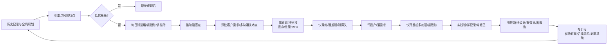

# AutoResearch

## What This Is

AutoResearch 是一个本地驱动的 LLM 训练/调试工作流平台。所有运行数据、状态、思考过程都留在本机 Mac 上，远程服务器（NPU/GPU）只是被远控的执行终端。平台提供 8 个独立 skill 串成一个"健康检查 → 训练 → 采集 → 报告"的最小循环，并把这 8 个 skill 包装成可被 Archon workflow 触发的标准单元，让用户既能 CLI 跑也能 `archon workflow run` 跑。

## Core Value

**核心竞争力：懂原理，知得失。** AutoResearch 的价值，是把 LLM 训练/调试从“一次跑完”变成可跟踪、可建模、可设计、可复盘、可投产评估的连续实践。懂原理，必须能解释模型、数据、系统、硬件、显存、性能/MFU 与调度机制；知得失，必须能说清一次尝试带来了什么、失去了什么、后续风险是什么、哪里必须求助。

人的主责：抓重点风险局点 → 拒绝低优先级任务 → 维护历史记录和全局规划 → 每天更新每个人力进展 → 多推动任务阻塞点 → 深挖掘客户需求 → 多沟通技术点。这部分依赖人与人之间的共识、信任、责任和资源协调，AI 可以辅助记录、提醒、归纳和建模，但不能替代人去完成。

基本循环：抓重点风险局点 → 拒绝低优先级任务 → 历史记录和全局规划 → 每天知进展、紧跟踪、多推动 → 深挖掘客户需求 → 多沟通技术点 → 懂原理 → 准建模（显存、性能/MFU）→ 知得失 → 快穿刺 → 理差距 → 评投产 → 落需求 → 快开发/多派活并紧跟踪 → 实践验 → 详记录 → 常修正 → 有推断 → 全设计 → 有效果 → 出报告。

并行与 AI 加速原则：

| 工作面 | 必须人来定 | 可并行推进 | AI/系统可加速 |
|---|---|---|---|
| 重点取舍 | 风险局点、优先级、拒绝低优先级任务 | 历史记录梳理、风险清单更新 | 检索历史、聚类问题、提示计划偏差 |
| 人力推进 | 每个人的进展判断、阻塞协调、资源求助 | 日报整理、阻塞复盘、会议纪要 | 生成进展摘要、阻塞清单、求助草稿 |
| 客户与技术沟通 | 需求真伪、业务优先级、技术承诺 | 客户问题归纳、技术点拆解 | 需求聚类、技术资料总结、开放问题列表 |
| 原理与建模 | 建模口径、关键假设、得失判断 | 显存估算、性能/MFU 估算、实验设计 | 容量模型、性能模型、穿刺方案草稿 |
| 开发与验证 | 投产标准、验收口径、派活边界 | 快开发、测试、数据采集、报告草稿 | 代码生成、测试补齐、日志分析、报告生成 |
| 汇报闭环 | 对外判断、风险暴露、必要求助 | 优势进展、风险列表、下一步计划 | 日报/周报/复盘报告草稿 |

每个 skill 跑一次，都必须留下可复盘、可二次开发的产物：事实记录、关键指标、失败与收益判断、建模假设、设计取舍、需求变更、验证结果和报告。

如果一切失败，这一条不能失败：用户的每一次实验，都能在本地找到 (a) 实验当时的 log、(b) wandb 指标、(c) 资源曲线、(d) 配置与代码 provenance、(e) 决策与变更记录、(f) 失败原因、收益代价与改进建议、(g) 优势进展、后续风险和必要求助。

## Requirements

### Validated

<!-- Shipped and confirmed valuable. -->

- ✓ CFG — customer config CLI and schema validation — v1.0
- ✓ SVC — local service stack and health checks — v1.0
- ✓ CORE — shared SSH/config/secrets/progress/log/layout foundations — v1.0
- ✓ HW — A2-AK-225 hardware probe path with BMC caveats — v1.0
- ✓ NET — local/remote network matrix and proxy fallback path with all-server UAT caveats — v1.0
- ✓ REACH — remote to local wandb/pushgateway reachability — v1.0
- ✓ STACK — verl stack health and one-step NPU dry run — v1.0
- ✓ COLL — local-first data collection for log/wandb/prom/manifest — v1.0
- ✓ RPT — single-file experiment report with log/wandb/prom views — v1.0
- ✓ ARCH — Archon workflow assets and main minimum loop — v1.0
- ✓ ORCH — top-level `check all`, `run smoke`, and failure diagnostics — v1.0
- ✓ E2E — full smoke loop under 30 minutes with complete report views — v1.0
- ✓ VERL-FORMAL — formal Qwen3.5-2B + geometry3k Verl case on Ascend with sync/async matrix, immutable configs, local artifacts, and multi-repo provenance — v1.1

### Active

<!-- Current scope. Building toward these. -->

**Next milestone candidates:**

- [ ] Close known hardware and network UAT gaps across all configured servers.
- [ ] Add CI or repeatable non-real-hardware test coverage for orchestration contracts.
- [ ] Harden retries, service startup recovery, and diagnostics for local services.
- [ ] Decide whether to support iBMC private APIs beyond Redfish.
- [ ] Broaden formal-case validation beyond the current two-sample geometry3k slice.

### Out of Scope

- **分布式训练调度（v2）** — v1 单机单卡跑通，多机调度留给后续里程碑
- **多云（v2）** — 假设用户主用一台远程 NPU 服务器，不接 AWS/Aliyun/Tencent 多云
- **多租户 / 团队协作（v2）** — v1 是单用户单本机，多人协作需要用户系统与权限层
- **Web UI 自研（v1 不做）** — 复用 Archon Web UI + wandb 自带 UI + Grafana，不再造轮子
- **全模型适配（v1 聚焦）** — v1 跑通 verl + veomni 两个框架即可，其他训练框架（torchtune、axolotl）留 v2
- **训练任务自动调度（v1 暂不做）** — Archon 没有内置 cron；v1 用 OS-level launchd/cron，v2 再做 archon-scheduler

## Context

**用户与硬件环境：**
- 单用户，单本机（macOS），开发主要在这台 Mac
- 远程服务器：Linux（Ubuntu/CentOS），配 NPU（Ascend 910 系列），偶发断网
- 远程账号：`root@192.168.13.154`，工作目录 `/home/t00906153`
- Mac 与远程通过 SSH 通信；远程无外网时通过 Mac 反向代理 (`127.0.0.1:7890`)

**技术栈：**
- 语言：Python 3.11+（与 verl/veomni 生态一致）
- 远程控制：paramiko（SSH 客户端），自研反向代理
- 本地服务：Docker Compose 起 Archon / wandb / Prometheus / Grafana
- 配置：Pydantic + YAML，敏感字段用系统 keyring
- CLI：Click 或 Typer
- 测试：pytest
- 文档：Markdown in `/docs`，架构图 in `/diagram`

**领域背景：**
- LLM 训练框架：verl（字节）、veomni（ByteDance 内部）
- NPU 监控：npu-smi、CANN 工具链
- 实验追踪：wandb（云或本地）、Prometheus（资源）
- 编排：Archon (coleam00/Archon, MIT)
- 渐进交付思想：GSD (open-gsd/gsd-core)
- 仓结构设计参考：maoxx241/vllm-ascend-workspace

**已知风险：**
- 远程无外网 → SSH 反向代理必须自动化且可重试
- NPU 监控命令因驱动版本差异可能字段不一样 → 解析层需要 fallback
- Archon 与我们的 8 skill 边界可能踩踏 → SKILL.md 顶部 "Use/Don't Use/Boundary" 必填
- verl/veomni 安装路径可能因 conda env 而异 → 通过 conda run 而非绝对路径

## Current State

v1.1 Formal Verl shipped on 2026-06-18.

- Primary E2E command: `autoresearch e2e smoke`
- Last real E2E run: `01KV62JVH0N3ZRVRMH4PYWF1VB`
- Formal Verl command: `autoresearch run verl-case`
- Final formal run: `formal-20260618-a2ak225-combined-r1`
- Formal report path: `/Users/Zhuanz/.autoresearch/runs/formal-20260618-a2ak225-combined-r1/report.html`
- Test suite at v1.1 close: 435 passed, 6 warnings
- Archive: `.planning/milestones/v1.0/`
- v1.1 archive: `.planning/milestones/v1.1-ROADMAP.md`, `.planning/milestones/v1.1-REQUIREMENTS.md`, `.planning/milestones/v1.1-MILESTONE-AUDIT.md`

## Next Milestone Goals

The next milestone is not defined yet. Strong candidates are hardening rather
than expanding scope: close known multi-server hardware/network gaps, improve
recovery around local services and remote proxy instability, broaden
formal-case validation, and add CI-friendly guardrails for orchestration
contracts that do not require the real A2-AK-225 server.

## Constraints

- **Tech stack**: Python 3.11+（与训练栈一致）
- **License**: MIT（与 Archon / vllm-ascend-workspace 对齐）
- **Local-first**: 所有 run 数据、log、wandb 落本地 Mac，远程不留状态
- **No network on remote**: 必须支持远程无外网场景，SSH 反向代理是必备能力
- **Self-contained skills**: 每个 skill 可独立运行，技能之间不强依赖
- **Archon-compatible**: 8 skill 必须能包装成 Archon workflow YAML，可被 `archon workflow run` 触发
- **可视化优先**: 每个 skill 输出必须可被 Grafana/wandb/HTML 报告消费

## Key Decisions

| Decision | Rationale | Outcome |
|----------|-----------|---------|
| 三沉淀层架构 (workspace-core / verl-adapter / datalake) | 通用 / 训练栈 / 数据 三类内容互不混用，便于单 skill 独立维护 | ✓ Good |
| 8 skill 1:1 映射到 8 步最小循环 | 每个 step = 一个可独立验证的 skill | ✓ Good |
| Archon 集成进 M1 (用户决策 2B) | M1 就要让 8 skill 可被 `archon workflow run` 触发 | ✓ Good, provider auth caveat |
| Docker Compose 起本地服务栈 | 与 Mac 环境隔离，启停干净 | ✓ Good |
| 远程 → 本地 wandb 用 wandb sync + offline 模式 | wandb 原生支持，无需自造轮子 | ✓ Good |
| SSH 反向代理用 paramiko 通道 + 进程内调度 | 避免外部 ssh 命令依赖，便于在 Python 上下文做重试 | ⚠ Revisit implementation details in v1.1 |
| 进度协议用 stderr `__AR_PROGRESS__=<json>` 标记 | 与 vllm-ascend-workspace 模式一致，便于 AI 协作者解析 | ✓ Good |
| M1 范围 13 个阶段 | 含 Archon 适配 + 顶层 CLI + E2E + 归档 | ✓ Good |
| Formal Verl case 作为 v1.1 竖切 | 先跑真实 Qwen3.5-2B + geometry3k 闭环，再扩硬化范围 | ✓ Good |
| v1.1 以不可变 run bundle 绑定代码 provenance | 实验数据必须能反查 AutoResearch/verl/vllm commit 与配置 | ✓ Good |
| 超长行结果允许 recovery metadata 重建 | SSH stdout 可能挂住，最终事实以远端日志、validation 和本地同步 artifact 为准 | ✓ Good |

---
*Last updated: 2026-07-02 after full-chain workflow visualization*
