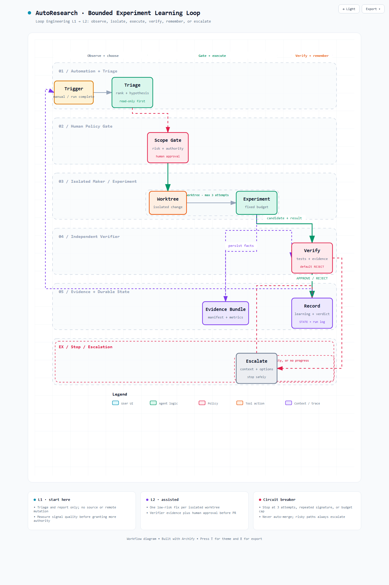

# 用 Loop Engineering 设计 AutoResearch 闭环

## 它解决什么问题

Loop Engineering 的核心不是把 prompt 写得更长，而是把“谁在什么时候、基于什么状态、以什么权限、如何验证、何时停止”设计成一个可运行的控制系统。

可以把它理解为：

```text
单次 agent harness
+ 调度/触发
+ 持久状态
+ 隔离执行
+ 独立验证
+ 外部连接器
+ 人工权限门与熔断
= loop
```

它强调六个构件：自动化/调度、worktree、skills、插件与连接器、maker/checker 子角色，以及对话之外的持久记忆。价值在于让每次运行都继承事实和约束，而不是让 agent 每次冷启动后猜测意图。

## 本仓的循环设计

AutoResearch 已经有很好的实验事实链：远程训练、日志/W&B/Prometheus 采集、manifest、HTML 报告和 Git provenance。缺少的是这些事实如何安全地驱动“下一轮”。本设计增加以下控制面：

1. **Trigger**：手动或实验完成事件触发；L1 不启用无人值守定时执行。
2. **Triage**：读取最新 run bundle，把问题先分到模型、数据、系统、硬件或环境层。
3. **Hypothesis**：每轮只保留一个可证伪假设和一个最小验证动作。
4. **Gate**：远程计算、凭据、BMC、网络/服务配置和外部写入均需人工批准。
5. **Isolated maker**：L2 才允许在独立 worktree 中实现一次有界改动。
6. **Independent verifier**：与 maker 分离，默认 `REJECT`，独立跑测试并检查证据可比性。
7. **Decision**：以 `KEEP`、`REJECT` 或 `ESCALATE_HUMAN` 结束。
8. **Memory**：把压缩结论写回 `STATE.md`，把过程追加到 `loop-run-log.md`；实验事实仍以 run bundle 为准。

[](../diagram/autoresearch-loop.workflow.html)

运行视图见：

- `diagram/autoresearch-loop.architecture.html`：组件、边界与数据/控制关系；
- `diagram/autoresearch-loop.workflow.html`：一次循环的状态推进与异常出口。

## 从 L1 到 L3

| 等级 | 权限 | 本仓建议 |
|---|---|---|
| L1 report-only | 只读分诊和状态报告 | 先运行 1–2 周，统计有效发现率和噪声 |
| L2 assisted | 隔离 worktree 中做低风险改动；独立 verifier；人工批准 PR | 只开放明确 allowlist，一次一个假设 |
| L3 unattended | 自动修复/提 PR/动作 | 当前不建议；真实硬件、成本和安全边界使人工门仍必要 |

不要从 L1 直接跳到 L3。速度不是成熟度；能可靠停止、升级和解释，才是成熟度。

## 如何使用 loop-engineering

### 1. 给普通 Codex 项目脚手架

```bash
npx @cobusgreyling/loop-init . --pattern daily-triage --tool codex
```

它会创建循环配置、状态、skill 和 verifier starter。AutoResearch 已按其结构定制，因此不要在本仓直接重复覆盖这些文件。

### 2. 估算运行成本

```bash
npx @cobusgreyling/loop-cost --pattern daily-triage --level L1
```

先把 cadence、agent 数量和每轮 token 成本算清楚，再谈无人值守。

### 3. 审计“是否可循环”

```bash
npx @cobusgreyling/loop-audit . --suggest
```

分数不是质量证明，但能快速发现缺失的状态、verifier、预算、约束、run log、最小权限和熔断。

### 4. 检查配置和状态是否漂移

```bash
npx @cobusgreyling/loop-sync .
```

例如 `LOOP.md` 还写 L1，`STATE.md` 却记录了自动修改源码，这就是必须处理的漂移。

### 5. 长循环加熔断

```bash
npx @cobusgreyling/loop-context --check --ledger run.json
```

它用于管理长运行的状态与 circuit breaker。AutoResearch 还在 L1，不需要为了“工具齐全”而提前引入常驻运行。

## 在本仓手动跑第一轮

在 Codex 中执行：

```text
Run $loop-triage. Read LOOP.md and STATE.md first.
Inspect the latest available run evidence. Report only; do not modify source
or run remote commands. Propose exact STATE.md and loop-run-log.md updates.
```

人工检查三件事：它找的是否真是重点、证据是否足以支持假设、建议动作是否小到能单独证伪。只有连续多次表现可靠，才考虑通过 Codex Automation 加入日程或实验完成触发器。

## 常见反模式

- maker 自己给自己验收；
- “一直试到成功”而没有尝试上限；
- 三个循环共享一份无 schema 的状态；
- 第一天就给 MCP 全写权限或自动 merge；
- 用改业务代码掩盖 flaky CI / 环境故障；
- 只有当前状态，没有 append-only run log；
- 没有 kill switch，预算耗尽后仍继续。

本仓对应的防线分别落在 `.codex/agents/verifier.toml`、`LOOP.md`、`STATE.md`、`loop-constraints.md`、`loop-budget.md` 和 `loop-run-log.md`。

## 参考

- [Loop Engineering repository](https://github.com/cobusgreyling/loop-engineering)
- [Quickstart](https://github.com/cobusgreyling/loop-engineering/blob/main/docs/QUICKSTART.md)
- [Concepts and vocabulary](https://github.com/cobusgreyling/loop-engineering/blob/main/docs/concepts.md)
- [Anti-patterns](https://github.com/cobusgreyling/loop-engineering/blob/main/docs/anti-patterns.md)
- [Codex minimal-loop starter](https://github.com/cobusgreyling/loop-engineering/tree/main/starters/minimal-loop-codex)
